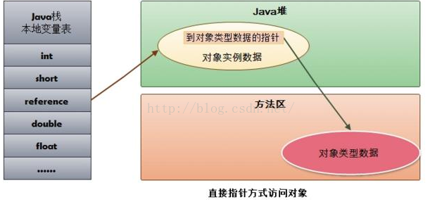

# HotSpot 虚拟机对象探秘

## 对象的创建

普通 Java 对象（不包括数组和 Class 对象）的创建过程：

1. 虚拟机遇到一个 new 指令时，首先将去检查这个指令的参数是否在常量池中定位到一个类的
符合引用，并且检查这个符号引用代表的类是否已被加载、解析和初始化过。

2. 在类加载检查通过后，虚拟机将为新生对象分配内存。

+ `Bump the Pointer`

如果 Java 堆中的内存是绝对规整的，已使用的内存放在一边，空闲的内存放在另一边，中间放着一个指针作为分界点的指示器，那所分
配内存仅仅是把那个指针向空闲空间那边挪动一段与对象大小相等的距离。这种方式成为“指针碰撞”。

> 通常使用 `Serial`、`ParNew` 等带 `Compact`过程的收集器时，系统采用的分配方法是指针碰撞。

+ `Free List`

如果 Java 堆中的内存不是规整的，已使用的内存和空闲的内存相互交错，在分配的时候需要从列表总找到一个足够大的空间划分给对象
实例，并且更新列表上的记录，这种方式为“空闲列表”。

> 使用 `CMS` 这种基于 `Mark-Sweep` 算法的收集器时，采用空闲列表。

3. 对象创建在虚拟机中是非常频繁的行为，在并发的情况下不是线程安全的。

+ 对分配内存空间的动作进行同步处理：虚拟机采用 `CAS` 配上失败重试的方式保证更新操作的原子性。

+ 采用本地线程分配缓冲 `Thread Local Allocation Buffer`,通过 `-XX:+/-UseTLAB` 参数来配置。

> 把内存分配的动作按照线程划分在不同的空间上进行，即每个线程在 Java 堆中预先分配一块内存。

4. 内存分配完成后，虚拟机将分配的内存空间初始化零值。

5. 虚拟机对对象进行必要的设置，设置对象头（属于哪个类的实例、类的元数据、对象的哈希码、对象的 `GC` 分代年龄）等信息。

6. 执行 `init` 方法，完成对象的初始化。

## 对象的内存布局

对象在内存中存储的布局：

+ 对象头 `Header`

1. 存储对象自身的运行时数据，如哈希码、GC 分代年龄、锁状态标志、线程持有的锁、偏向线程ID、偏向时间戳，数据长度在 32bit 和 64bit.
2. 类型指针，即对象指向类元数据的指针，虚拟机通过这个指针来确定对象属于哪个类的实例。

+ 实例数据 `Instance Data`

受虚拟机分配策略参数和字段在 Java 源码中定义的顺序的影响。HotSpot 的默认分配策略参数为 `longs/doubles`,`ints`,`shorts/chars`,`bytes/boolean`,`oops`。
相同宽度的字段总是被分配到一起。

+ 对齐填充 `Padding`

无意义，HotSpot VM 必须是 8 字节的整数倍。对象实例部分数据未对齐时，需要通过对其填充来补全。

##　对象的访问定位

Java　通过栈上的　reference　数据来操作堆上的具体对象。访问方式有使用句柄和直接指针两种。

+ 使用句柄

> 最大的好处是 reference 中存储的是稳定的句柄的地址，在对象被移动时只会改变句柄中的实例数据指针，而 reference 本身不需要修改。

+ 直接指针

> 最大好处是速度更快，节省了一次指针定位的时间开销。 HotSpot 采用的是直接指针方式。