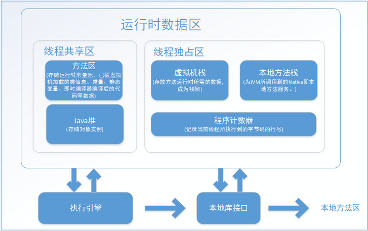

# 运行时数据区域

## 线程私有

### 程序计数器: 

java 虚拟机规范中没有规定任何 OutOfMemoryError 情况的区域。

### java 虚拟机栈

Java 虚拟机规范中，对于这个区域规定了两种异常状况：

+ 如果线程请求的栈的深度超过虚拟机所允许的深度，将抛出 StackOverflowError 异常。
+ 如果虚拟机栈可以扩展，如果扩展时无法申请到足够内存，将会抛出 OutOfMemoryError 异常。

### 本地方法栈

本地方法栈区域也会抛出 StackOverflowError 和 OutOfMemoryError 异常。

## 线程共享区

### Java 堆

Java 堆 （ GC 堆）是垃圾收集器的主要区域。可以分为：新生代和老生代，还可以细致的分为 Eden 空间、From Surivivor 空间、To Survivor 空间。

Java 虚拟机规范中， Java 堆可以处于物理上不连续的内存空间中，逻辑上连续的即可。在实现时，既可以实现固定大小的，也可以是可扩展的。
如果堆中没有内存完成实例分配，并且堆无法再扩展时，将会抛出 OutOfMemoryError 异常。

> 通过 `-Xmx` 和 `-Xms` 控制。

### 方法区

HotSpot 虚拟机把 GC 分代收集扩展至方法区，或者使用永久代来实现方法区。（此种方式即将放弃）。

Java 虚拟机规范对于方法去的限制非常宽松，除了和 Java 堆一样不需要连续的内存可以选择固定大小或可扩展外，还可以选择不实现垃圾收集。

