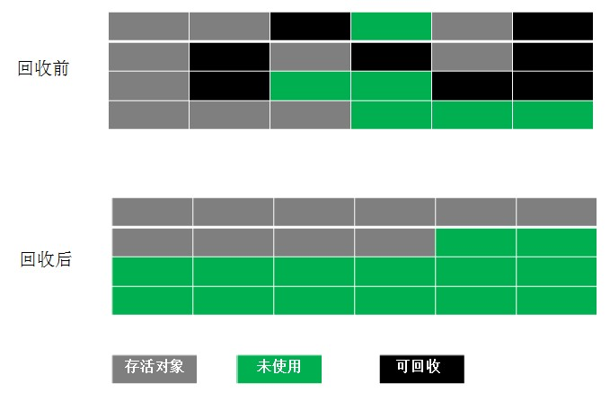

# 垃圾回收算法

## 标记-清除算法 Mark-Sweep

标记-清除算法分为两个阶段：标记阶段和清除阶段。标记阶段的任务是标记出所有需要被回收的对象，清除阶段就是回收被标记的对象所占用的空间。

+ 优点：简单，容易实现。
+ 缺点：容易产生内存碎片，碎片太多可能会导致后续过程中需要为大对象分配空间时无法找到足够的空间而提前触发新的一次垃圾收集动作。

## 复制算法 Copying

复制算法将可用内存按容量划分为大小相等的两块，每次只使用其中的一块。当这一块的内存用完了，就将还存活着的对象复制到另外一块上面，然后再把已使用的内存空间一次清理掉，这样一来就不容易出现内存碎片的问题。

+ 优点：实现简单，运行高效且不容易产生内存碎片
+ 缺点：却对内存空间的使用做出了高昂的代价，因为能够使用的内存缩减到原来的一半。

从算法原理我们可以看出，Copying算法的效率跟存活对象的数目多少有很大的关系，如果存活对象很多，那么Copying算法的效率将会大大降低。

## 标记整理算法 Mark-Compact

该算法标记阶段和Mark-Sweep一样，但是在完成标记之后，它不是直接清理可回收对象，而是将存活对象都向一端移动，然后清理掉端边界以外的内存。

所以，特别适用于存活对象多，回收对象少的情况下。

## 分代回收算法

分代回收算法其实不算一种新的算法，而是根据复制算法和标记整理算法的的特点综合而成。这种综合是考虑到java的语言特性的。
这里重复一下两种老算法的适用场景：

>复制算法：适用于存活对象很少。回收对象多

>标记整理算法: 适用用于存活对象多，回收对象少

刚好互补！不同类型的对象生命周期决定了更适合采用哪种算法。

于是，我们根据对象存活的生命周期将内存划分为若干个不同的区域。一般情况下将堆区划分为老年代（Old Generation）和新生代（Young Generation），老年代的特点是每次垃圾收集时只有少量对象需要被回收，而新生代的特点是每次垃圾回收时都有大量的对象需要被回收，那么就可以根据不同代的特点采取最适合的收集算法。
这就是分代回收算法。

我们再说的细一点：

>1. 对于新生代采取Copying算法，因为新生代中每次垃圾回收都要回收大部分对象，也就是说需要复制的操作次数较少，采用Copying算法效率最高。但是，但是，但是，实际中并不是按照上面算法中说的1：1的比例来划分新生代的空间的，而是将新生代划分为一块较大的Eden空间和两块较小的Survivor空间，比例为8：1：1.。为什么？下一节深入分析。

>2. 由于老年代的特点是每次回收都只回收少量对象，一般使用的是Mark-Compact算法。