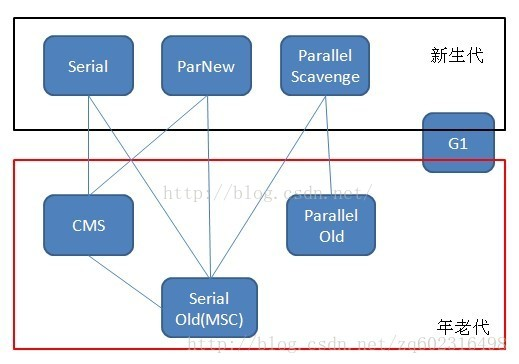
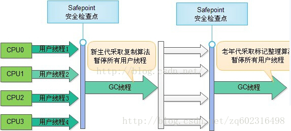
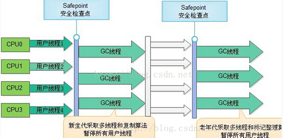
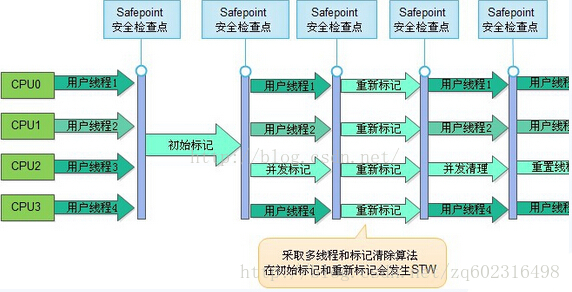
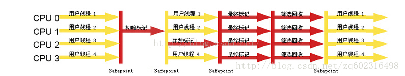

# 垃圾收集器

如果说收集算法是内存回收的方法论，那么垃圾收集器就是内存回收的具体实现。目前垃圾收集器基本都采用分代收集，因此一个垃圾收集器中一般都存在多种垃圾回收算法。
不同的虚拟机提供的垃圾收集器也有很大差异，如下是HotSpot虚拟机基于JDK1.7版本所包含的所有垃圾收集器：



HotSpot中共有7中不同的垃圾收集器，如果两个收集器之间存在连线，说明它们之间可以搭配使用，其中，Serial、ParNew、Parallel Scavenge属于新生代收集器，
CMS、Serial Old、Parallel Old属于老年代收集器，G1是最新的一种收集器，在新生代和老年代中都可使用。

## Serial（串行）收集器

最基本、发展历史最悠久的一种收集器。看名字就知道，这个收集器是一个单线程的收集器，只使用一个CPU或一条收集线程去完成垃圾收集工作，最重要的是，
在它进行垃圾收集的时候，必须暂停其他所有的工作线程，知道它收集结束。虽然有这个缺点，但是依然是虚拟机运行在Client模式下的默认新生代收集器。优点是：简单而高效，没有线程交互的开销。运行过程如图：



新生代采用的是“复制算法”，老年代采用的是“标记-整理”算法。

## ParNew 收集器

ParNew收集器其实就是Serial收集器的多线程版本，除了使用多条线程进行垃圾收集之外，其他行为和Serial收集器一样。ParNew是许多运行在Server模式下的虚拟机中首选的新生代收集器，其中有一个与性能无关的重要原因，除了Serial收集器外，目前只有ParNew能与老年代的CMS收集器配合使用。ParNew是一种并行的收集器。在垃圾回收中，并行是指：多条垃圾收集线程并行工作，用户线程处于等待状态；并发是指：用户线程和垃圾收集线程同时执行（不一定并行，可能交替执行）。

##　Parallel Scavenge 收集器

Parallel Scavenge收集器使用的是复制算法，也是一个并行的多线程收集器。和ParNew相似，但是Parallel Scavenge的关注点不同，CMS收集器的关注点是尽可能地缩短垃圾收集时用户线程的停顿时间，而Parallel Scavenge收集器的目标则是达到一个可控制的吞吐量，吞吐量 = 运行用户代码时间 / (运行用户代码时间 + 垃圾收集时间)。

## Serial Old 收集器

Serial Old收集器是新生代Serial收集器的老年代版本，同样是一个单线程收集器，使用“标记-整理”算法，Serial Old的主要意义也是在于给Client模式下的虚拟机使用。


## Parallel Old 收集器

Parallel Old是新生代收集器Prarllel Scavenge的老年代版本，使用多线程和“标记-整理”算法。运行流程如下：



## CMS收集器
CMS（Concurrent Mark Sweep）收集器是一种以获取最短回收停顿时间为目标的收集器。对于互联网站或者B/S系统的这种注重响应速度的服务端来说，CMS是很好的选择。从名字Mark Sweep可以看出，CMS是基于“标记-清除”算法实现的，分为四个步骤：

1. 初始标记（CMS initial mark）：仅仅标记一GC Roots能直接关联到的对象，这个步骤需要“stop the world”；
2. 并发标记（CMS concurrent mark）：就是GC Roots进行可达性分析阶段，可并发执行；
3. 重新标记（CMS remark）：修正并发标记期间发生变动的那一部分对象，这个步骤需要“stop the world”；
4. 并发清除（CMS concurrent sweep）：执行清除阶段。



可以看到，初始标记和重新标记阶段都是并行的，需要暂停用户线程（过程比较短）；在并发标记和并发清除阶段是并发的，可以和用户线程一起工作。

CMS的优点：并发收集、低停顿。

CMS的缺点：

1. 对CPU资源非常敏感，面向并发设计程序的通病，虽然不至于导致用户线程停顿，但是会降低吞吐率；
2. 无法清理“浮动垃圾”，由于CMS并发清理阶段用户线程还在运行着，伴随程序运行自然就还会有新的垃圾不断出现，这一部分垃圾出现在标记过程之后，CMS无法在当次收集中处理掉它们，只好留待下一次的GC；
3. 会产生大量空间碎片，因为CMS是基于“标记-清除”算法，这种算法的最大缺点就是会产生大量空间碎片，给分配大对象带来麻烦，不得不提前触发Full GC。为了解决这个问题，CMS提供了一个“-XX:+UseCMSCompaceAtFullCollection”的开关参数（默认开启），用于在CMS收集器顶不住要进行Full GC时开启内存碎片的合并整理过程。

## G1收集器

G1收集器是最新的一款收集器，JDK1.7才发布，是一种面向服务端应用的垃圾收集器，有如下特点：

1. 并行与并发：G1能充分利用多CPU、多核环境下的硬件优势，使用多个CPU（CPU或者CPU核心）来缩短Stop-The-World停顿的时间；
2. 分代收集：分代概念在G1中依然得以保留。虽然G1可以不需其他收集器配合就能独立管理整个GC堆，但它能够采用不同的方式去处理新创建的对象和已经存活了一段时间、熬过多次GC的旧对象以获取更好的收集效果；
3. 空间整合：与CMS的“标记-清理”算法不同，G1从整体看来是基于“标记-整理”算法实现的收集器，从局部（两个Region之间）上看是基于“复制”算法实现，无论如何，这两种算法都意味着G1运作期间不会产生内存空间碎片，收集后能提供规整的可用内存；
4. 可预测的停顿时间；

使用G1收集器时，Java堆的内存布局与就与其他收集器有很大差别，它将整个Java堆划分为多个大小相等的独立区域（Region），虽然还保留有新生代和老年代的概念，但新生代和老年代不再是物理隔离的了，它们都是一部分Region（不需要连续）的集合。

G1的收集过程分为以下几个步骤：

1. 初始标记（Initial Marking）
2. 并发标记（Concurrent Marking）
3. 最终标记（Final Marking）
4. 筛选回收（Live Data Counting and Evacuation）

前几个步骤和CMS有很多相似之处。运行示意图如下：



## 理解 GC 日志
 
```java
0.174: [GC [PSYoungGen: 8028K->600K(76288K)] 8028K->600K(249856K), 0.0658845 secs] [Times: user=0.13 sys=0.00, real=0.07 secs] 
0.240: [Full GC [PSYoungGen: 600K->0K(76288K)] [ParOldGen: 0K->508K(173568K)] 600K->508K(249856K) [PSPermGen: 2751K->2750K(21504K)], 0.0160570 secs] [Times: user=0.03 sys=0.00, real=0.02 secs] 
Heap
 PSYoungGen      total 76288K, used 1966K [0x00000007ab200000, 0x00000007b0700000, 0x0000000800000000)
  eden space 65536K, 3% used [0x00000007ab200000,0x00000007ab3eb920,0x00000007af200000)
  from space 10752K, 0% used [0x00000007af200000,0x00000007af200000,0x00000007afc80000)
  to   space 10752K, 0% used [0x00000007afc80000,0x00000007afc80000,0x00000007b0700000)
 ParOldGen       total 173568K, used 508K [0x0000000701600000, 0x000000070bf80000, 0x00000007ab200000)
  object space 173568K, 0% used [0x0000000701600000,0x000000070167f018,0x000000070bf80000)
 PSPermGen       total 21504K, used 2757K [0x00000006fc400000, 0x00000006fd900000, 0x0000000701600000)
  object space 21504K, 12% used [0x00000006fc400000,0x00000006fc6b14e8,0x00000006fd900000)
```

+ `0.174`   代表 GC 发生的时间，虚拟机启动以来经过的秒数。
+ `[GC  [Full GC` 说明垃圾手机的停顿类型，Full 说明本次 GC 发生了 Stop-The-World 的。
+ `[PSYoungGen [ParOldGen [PSPermGen ` 表示 GC 发生的区域。
+ ` 600K->0K(76288K)` 表示 GC 前 Java 堆已使用容量 -> GC 后 Java 堆已使用容量( Java 堆总容量)
+ ` 0.0160570 secs` 表示 该内存区域 GC 所占用的时间 单位是秒
+ ` [Times: user=0.03 sys=0.00, real=0.02 secs]` user 用户态消耗的 CPU 时间, sys 内核态消耗的 CPU 时间, real 操作从开始到结束经过的墙钟时间。