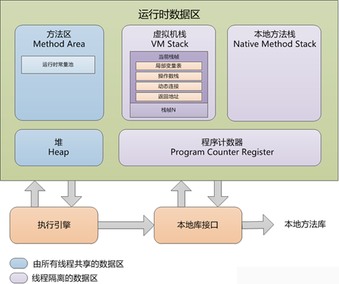

# java 运行时区域详解

Java 虚拟机管理的内存：




## 方法区

是各个线程共享的内存区域，它用于存储已被虚拟机加载的类信息、常量、静态变量、即时编译器编译后的代码等数据。


## 堆内存

参数：
```
-Xms20m -Xmx20m  -XX:+HeapDumpOnOutOfMemoryError -XX:+PrintGCDetails
```

```
public class HeapOOM {

    static class OOMObject {
    }

    public static void main(String[] args) {

        List<OOMObject> objectList = new ArrayList<OOMObject>();

        while (true){
            objectList.add(new OOMObject());
        }
    }
}
```

out:
```
[GC [PSYoungGen: 5499K->504K(6656K)] 5499K->3665K(20480K), 0.0069571 secs] [Times: user=0.00 sys=0.00, real=0.02 secs] 
[GC [PSYoungGen: 6011K->504K(6656K)] 9172K->8208K(20480K), 0.0163414 secs] [Times: user=0.03 sys=0.00, real=0.02 secs] 
[Full GC [PSYoungGen: 6648K->0K(6656K)] [ParOldGen: 10869K->13269K(13824K)] 17517K->13269K(20480K) [PSPermGen: 2753K->2752K(21504K)], 0.2035594 secs] [Times: user=0.31 sys=0.00, real=0.20 secs] 
[Full GC [PSYoungGen: 3084K->2552K(6656K)] [ParOldGen: 13269K->13781K(13824K)] 16354K->16334K(20480K) [PSPermGen: 2752K->2752K(21504K)], 0.1090489 secs] [Times: user=0.22 sys=0.00, real=0.11 secs] 
[Full GC [PSYoungGen: 2552K->2552K(6656K)] [ParOldGen: 13781K->13770K(13824K)] 16334K->16322K(20480K) [PSPermGen: 2752K->2752K(21504K)], 0.1483199 secs] [Times: user=0.27 sys=0.02, real=0.15 secs] 
java.lang.OutOfMemoryError: Java heap space
Dumping heap to java_pid2768.hprof ...
Exception in thread "main" java.lang.OutOfMemoryError: Java heap space
	at java.util.Arrays.copyOf(Arrays.java:2245)
	at java.util.Arrays.copyOf(Arrays.java:2219)
	at java.util.ArrayList.grow(ArrayList.java:242)
	at java.util.ArrayList.ensureExplicitCapacity(ArrayList.java:216)
	at java.util.ArrayList.ensureCapacityInternal(ArrayList.java:208)
	at java.util.ArrayList.add(ArrayList.java:440)
	at com.xc.oom.HeapOOM.main(HeapOOM.java:36)
Heap dump file created [28003165 bytes in 0.130 secs]
Heap
 PSYoungGen      total 6656K, used 2711K [0x00000000ff900000, 0x0000000100000000, 0x0000000100000000)
  eden space 6144K, 44% used [0x00000000ff900000,0x00000000ffba5c98,0x00000000fff00000)
  from space 512K, 0% used [0x00000000fff80000,0x00000000fff80000,0x0000000100000000)
  to   space 512K, 0% used [0x00000000fff00000,0x00000000fff00000,0x00000000fff80000)
 ParOldGen       total 13824K, used 13770K [0x00000000feb80000, 0x00000000ff900000, 0x00000000ff900000)
  object space 13824K, 99% used [0x00000000feb80000,0x00000000ff8f28e0,0x00000000ff900000)
 PSPermGen       total 21504K, used 2783K [0x00000000f9980000, 0x00000000fae80000, 0x00000000feb80000)
  object space 21504K, 12% used [0x00000000f9980000,0x00000000f9c37fa0,0x00000000fae80000)
```

GC 实例

```
JAVA_OPTS='-server -Xms2048m -Xmx4096m  -XX:MaxNewSize=1800m -XX:PermSize=512M -XX:MaxPermSize=1024M -XX:ReservedCodeCacheSize=256M'
```

JAVA_OPTS='-server -Xms2048m -Xmx4096m  -XX:MaxNewSize=1800m -XX:PermSize=512M -XX:MaxPermSize=1024M -XX:ReservedCodeCacheSize=256M'
-server 一定要作为第一个参数，在多个CPU时性能佳
-XX:MaxNewSize=1800m 新生成对象能占用内存的最大值1800M
-Xms2048m -Xmx4096m jvm堆 初始分配2048M，最带分配4096M
-XX:PermSize=512M -XX:MaxPermSize=1024M方法区 初始分配512M 最大分配1024M
-XX:ReservedCodeCacheSize=256M 设置代码缓存的最大值，编译时用