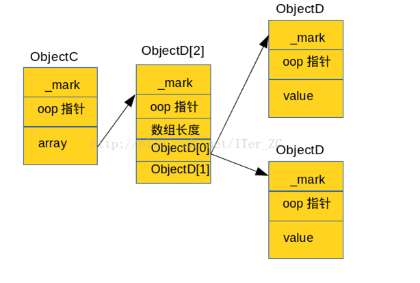

# Java 内存对象结构

## Java对象表示模型

Java对象的表示模型叫做“OOP-Klass”二分模型，包括两部分:
- OOP，即Ordinary Object Point，普通对象指针，用来表示对象的实例信息；
- Klass，包含了元数据和方法信息等，用来描述Java类。

JVM运行时加载一个Class时，会在JVM内部创建一个instanceKlass对象，表示这个类的运行时元数据。创建一个对应Class的Java对象时，会在JVM内部相应的创建一个instanceOop来表示这个Java对象。

元数据—— instanceKlass对象会存在元空间（方法区），对象实例—— instanceOopDesc会存在Java堆。Java虚拟机栈中会存有这个对象实例的引用。

## 对象内存布局的规则

- 任何对象都是8个字节为粒度进行对齐的；

- 指定内存布局顺序；

- 不同类继承关系中的成员不能混合排列，首先按照规则2处理父类中的成员，接着才是子类的成员;

- 当父类中最后一个成员和子类第一个成员的间隔如果不够4个字节的话，就必须扩展到4个字节的基本单位;

- 如果子类第一个成员是一个双精度或者长整型，并且父类并没有用完8个字节，JVM会破坏规则2，按照整形（int），短整型（short），字节型（byte），引用类型（reference）的顺序，向未填满的空间填充。

- 非静态内部类 （Non-static inner classes）有一个额外的“隐藏”成员，这个成员是一个指向外部类的引用变量，有4个字节的额外开销。


**类属性按照如下优先级进行排列**

长整型和双精度类型；整型和浮点型；字符和短整型；字节类型和布尔类型，最后是引用类型。这些属性都按照各自的单位对齐。

1. [8]双精度型（doubles）和长整型（longs）
2. [4]整型（ints）和浮点型（floats）
3. [2]短整型（shorts）和字符型（chars）
4. [1]布尔型（booleans）和字节型（bytes）
5. [4]引用类型（references）

## 计算对象大小

- 通过java.lang.instrument.Instrumentation的getObjectSize(obj)直接获取对象的大小;
- 通过sun.misc.Unsafe对象的objectFieldOffset(field)等方法结合反射来计算对象的大小;

**普通对象的结构**： 

1. 对象头(_mark)， 8个字节
2. Oop指针，如果是32G内存以下的，默认开启对象指针压缩，4个字节
3. 数据区
4. Padding(内存对齐)，以8的倍数对齐

**数组对象的结构**：

1. 对象头(_mark)， 8个字节
2. Oop指针，如果是32G内存以下的，默认开启对象指针压缩，4个字节
3. 数组长度，4个字节
4. 数据区
5. Padding(内存对齐)，以8的倍数对齐

**空对象大小：16个字节**

1. 对象头(_mark)， 8个字节
2. Oop指针，4个字节

eg：

```
    class Person {
        String str1;  	// 4b
        int int1; 		// 4b
        byte byte1; 	// 1b
        boolean boolean1; // 1b
        int int2;  		// 4b
        Object obj; 	//4b
        byte byte2;  	// 1b
        long long1;	//8b
    }
```

Person person = new Person() 的大小
- 8(_mark) + 4(oop指针) 
- 根据规则5，差4个即可满足8倍数对齐，故先布局int1参数；
- 根据规则2，继续布局后续排位；
- 所以计算的结果是40

```
class ObjectA {  
        ObjectB[] array = new ObjectB[2];  
}  

 class ObjectB {  
        int value;  
 } 
```
ObjectA obj = new ObjectA()的大小

- ObjectA的Shallow size = 8(_mark) + 4(oop指针)  + 4(ObjectB[]引用) = 16

- new ObjectB[2]数组的长度 =  8(_mark) + 4(oop指针) + 4(数组长度占4个字节) + 4(ObjectD[0]引用) + 4(ObjectD[1]引用) = 24

- 由于ObjectD[]数组没有指向具体的对象大小，所以计算的结果是16 + 24 = 40


```
class ObjectC{
    ObjectD[] array = new Object[2];

    public ObjectC(){
        array[0] = new ObjectD();
        array[1] = new ObjectD();
    }
}

private class ObjectD{

    int value;
}
```

ObjectC obj = new ObjectC()的大小

- ObjectC的Shallow size = 8(_mark) + 4(oop指针)  + 4(ObjectD[]引用) = 16

- new ObjectD[2]数组的长度 =  8(_mark) + 4(oop指针) + 4(数组长度占4个字节) + 4(ObjectD[0]引用) + 4(ObjectD[1]引用) = 24

- ObjectD对象长度 = 8(_mark) + 4(oop指针) + 4(value) = 16

- 所以ObjectC实际占用的空间 = 16 + 24 + 2 * 16 = 72


#### 通过sun.misc.Unsafe对象的objectFieldOffset(field)等方法结合反射来计算对象的大小;

```
package com.xc.object;

import org.omg.CORBA.Object;
import sun.misc.Unsafe;

import java.lang.reflect.Field;

/**
 * 通过sun.misc.Unsafe对象的objectFieldOffset(field)等方法结合反射来计算对象的大小;
 *
 * @author xiachuan at 2017/5/18 14:57。
 */

public class ObjectSize {

    class Person  {
        String str1;        //4
        int int1;           //4
        byte byte1;         //1
        boolean aBoolean;   //1
        int int2;           //4
        Object object;      //4
        byte byte2;         //1
        long long1;         //8
    }

    class ObjectA{
        ObjectB[] array = new ObjectB[2];
    }

    private class ObjectB{
        int value;
    }

    private static Unsafe unsafe;

    static {
        try {
            Field field = Unsafe.class.getDeclaredField("theUnsafe");
            field.setAccessible(true);
            unsafe = (Unsafe) field.get(null);
        } catch (IllegalAccessException e) {
            e.printStackTrace();
        } catch (NoSuchFieldException e) {
            e.printStackTrace();
        }
    }


    public static void showOffset(Field[] fields) {
        for (Field field : fields) {
            System.out.println(field.getName() + " offset: " + unsafe.objectFieldOffset(field));
        }
    }

    public static void main(String[] args) {
        Field[] fields = Person.class.getDeclaredFields();
        showOffset(fields);
    }
}
```
out:
```
str1 offset: 32
int1 offset: 12
byte1 offset: 28
aBoolean offset: 29
int2 offset: 24
object offset: 36
byte2 offset: 30
long1 offset: 16
this$0 offset: 40
```